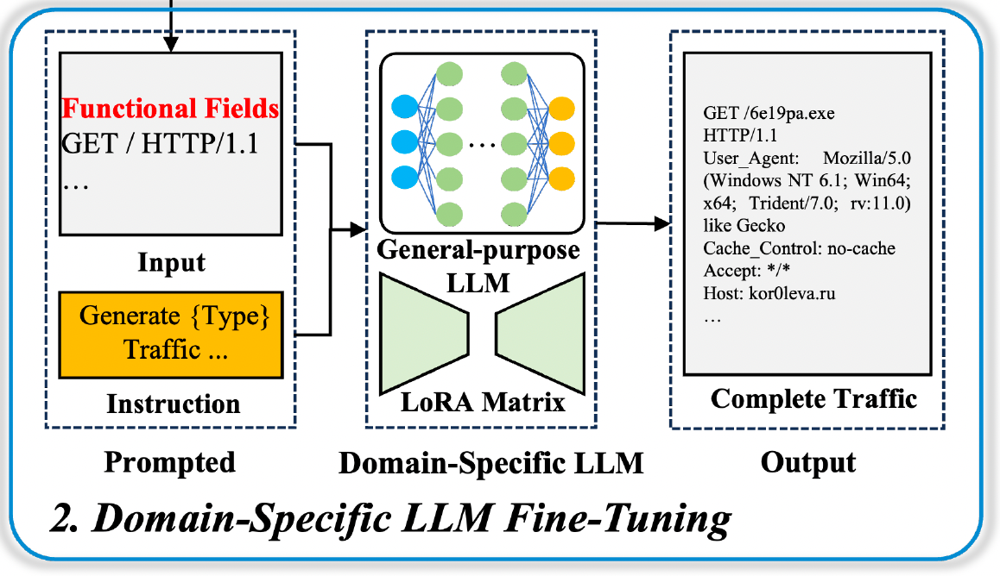
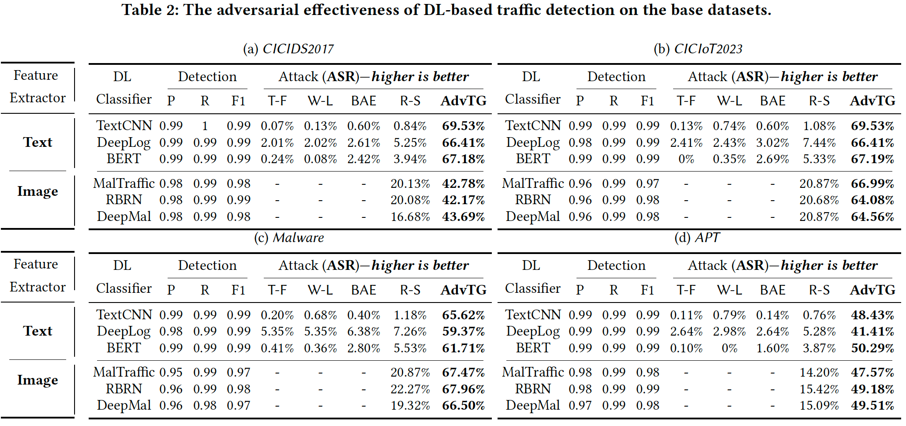

# 突破深度学习检测壁垒！LLM+RL范式生成对抗性流量，ASR超40%！

# 背景
在网络安全的“猫鼠游戏”中，恶意流量检测始终是核心防线。随着深度学习（DL）技术的普及，基于DL的恶意流量检测模型凭借自动特征提取、未知攻击识别等优势，成为学术和工业界的主流方案。但看似无懈可击的DL模型，实则存在致命短板。攻击者只需通过轻微修改流量特征，就能让模型将恶意流量误判为良性，导致攻击行为“隐身”逃脱。

然而，现有对抗性攻击方法大多“治标不治本”：
- 要么只能针对统计特征<a href="#ref1">[1]</a>、序列特征的检测模型，对基于payload（流量负载）分析的模型束手无策；
- 要么生成的流量违反网络协议、功能失效，无法应用于真实场景<a href="#ref2">[2]</a>。

因此，如何生成“泛化性、可用性、有效性”的对抗性流量，让模型能够从对抗样本中不断进化学习，提前适应0-day威胁，成为网络安全领域的关键。其中：
- 泛化性。对抗攻击应该具有泛化性，能够成功地绕过各种检测方案。
- 可用性。产生的流量在保持其功能性的同时必须遵守严格的协议合规性。
- 有效性。生成的对抗流量应该由完整的数据包组成，并且保持语义流量。

近日，发表于 WWW’25（ACM Web会议2025）的研究《AdvTG: An Adversarial Traffic Generation Framework to Deceive DL-Based Malicious Traffic Detection Models》<a href="#ref3">[3]</a>给出了答案。该框架创新性地结合大语言模型（LLM）和强化学习（RL），专门针对payload-based检测模型，生成高对抗性、高合规性的恶意流量，在6个检测模型、6个数据集上实现超 40% 的攻击成功率（ASR），显著超越现有方法。

# AdvTG 框架：三步实现“高欺骗性+高合规性”流量生成
AdvTG的核心思路是用LLM解决“语义合规+功能正常”的payload生成问题，用RL优化“对抗性”，让生成的流量既能在真实网络中运行，又能高效欺骗检测模型。总体技术框架如图所示：

## 多类型检测模型训练

AdvTG第一步就是构建一套检测模型，既作为对抗攻击的目标，又作为后续RL优化的评委（提供奖励反馈）。这套检测模型包含如下两类方法：
- **面向图像特征**：将流量字节流转化为 2D 灰度图，并采用CNN模型，捕捉payload负载特征；
- **面向文本特征**：将流量按协议规则token化，采用LSTM或BERT模型，捕捉语义和序列模式。

基于两种方式，训练6种DL模型（TextCNN、BERT、DeepLog、MalTraffic 等），从而能够覆盖CNN、LSTM、Transformer等架构（*泛化性*）。同时，这些模型不仅是攻击目标，还会对后续生成的对抗性流量打分 —— **能成功欺骗模型的流量得高分，被轻易识别的得低分**，为RL对抗生成优化提供反馈。

## 领域LLM微调
通用LLM并不懂网络协议，直接让它生成流量会出现各种问题。因此，AdvTG对LLM进行流量领域微调，让它成为**懂行**的流量生成器。

AdvTG设计了专门用于流量生成的提示，指导特定流量类别的生成，输入由功能字段组成。并由LLM生成非功能字段，形成一个完整的流量包。其中，功能字段是指核心必需字段，不能进行修改，比如HTTP请求行（GET/POST命令）、执行恶意命令的有效载荷。非功能字段是指不影响流量功能，但会被检测模型当作恶意的特征，比如 User-Agent（客户端标识）、Content-Type（内容类型）、Cache-Control（缓存控制）等。并通过LoRA微调，使LLM学习了良性和恶意流量的结构模式，根据指令生成相应的流量。

提示词由两部分组成，一条指令和一个功能字段。指基于功能字段，引导LLM产生来自相反类型的流量。例如，当输入由恶意流量的函数字段组成时，指令要求输出为良性流量。LLM会在提示的基础上产生偏离预期行为的良性流量。这使得攻击者可以根据每个输入的功能字段定制完整的对抗流量。

## 强化学习优化
微调后的LLM能生成合规流量，但并不能欺骗检测模型。AdvTG用强化学习（RL）进一步优化，让LLM学会**精准欺骗**。

该过程将检测模型视为只输出分数的黑盒系统，LLM根据检测模型的评价生成有效载荷并接收奖励分数。

采用强化学习优化对抗攻击生成策略。第一阶段训练的回报模型对LLM的输出结果进行评估，并利用评分结果更新LLM的参数。

本过程包含两个LLM：
- 具有冻结参数的领域特异性LLM
- 在训练过程中更新的RL-Tuned LLM。

该设置的目的是在保留原本大模型学习到的基础行为的同时，细化RL-Tuned LLM生成对抗流量的能力。使用第一阶段训练的多个检测模型对RL-Tuned LLM的输出进行评估。如下式所示，每个奖励模型提供一个奖励分数$r_\theta(x, y)$，可以解释为交叉熵函数的一个变体，称为负交叉熵。
$$
r_\theta(x, y) = -\frac{1}{N} \sum_{i=1}^N \left[ (1-L_x) \log(D_i(y)) + L_x \log(1-D_i(y)) \right]
$$
最终的奖励分数被计算为多个奖励模型$D_i(y)$输出的平均值。

除了平均奖励分数外，还包含一个KL散度惩罚。该惩罚保证了RL-Tuned LLM在优化对抗性能的同时，其输出不会过度偏离特定领域LLM的行为。如式所示：
$$
R(x, y) = r_\theta(x, y) - \beta \log\left[ \pi_\phi^\mathrm{RL}(y \mid x) / \pi^\mathrm{SFT}(y \mid x) \right]
$$
# 实验结果
如表所示，该方法对各种模型的攻击成功率均超过了40%，最高的能够达到69.53%

微调前后，生成流量中的合规比例，微调前流量合规率仅16.40%~29.68%，
微调后合规率提升至82.75%~89.16%，满足真实网络传输要求。

# 参考文献
1. 
WANG M, YANG N, FORCADE-PERKINS N J, et al. ProGen: Projection-Based Adversarial Attack Generation Against Network Intrusion Detection [J]. IEEE Transactions on Information Forensics and Security, 2024, 19: 5476-91.

2. 
DEBICHA I, COCHEZ B, KENAZA T, et al. Adv-Bot: Realistic adversarial botnet attacks against network intrusion detection systems [J]. Computers & Security, 2023, 129: 103176.

3. 
<a href="https://github.com/TrafficDetection-art/AdvTG">https://github.com/TrafficDetection-art/AdvTG</a>

