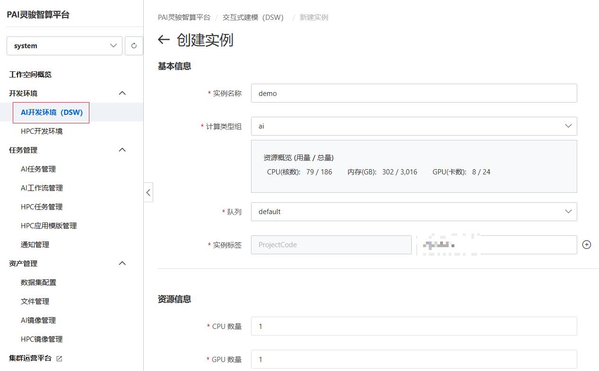
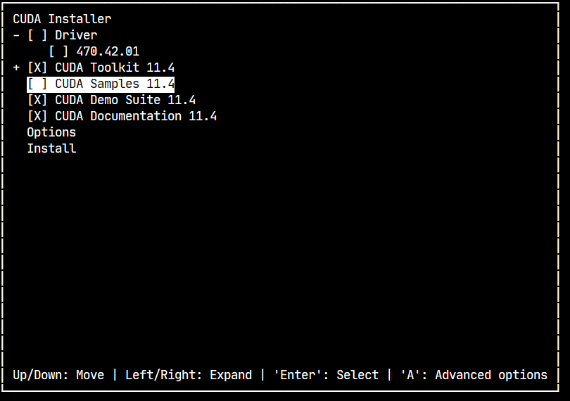
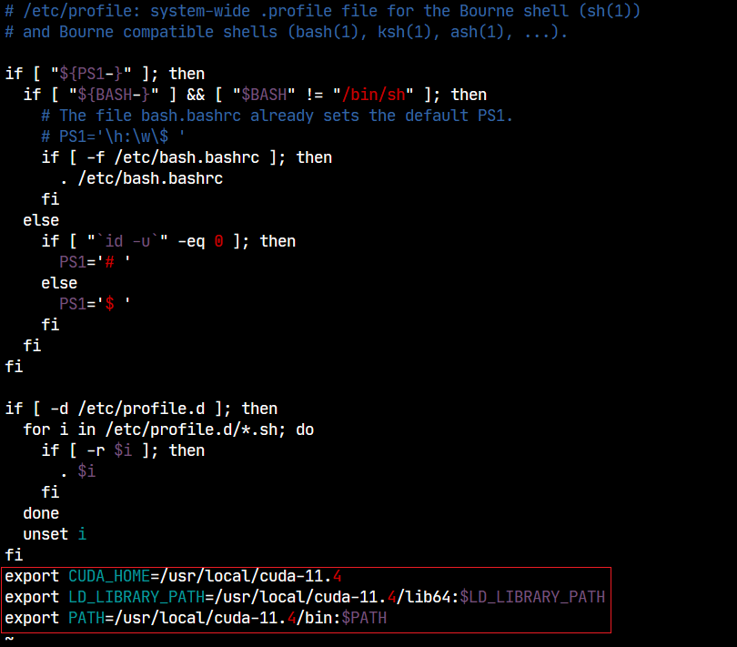

+++
title = '阿里云PAI平台搭建pytorch-cuda11.4环境'
date = 2023-12-14T15:11:01+08:00
tags=['cuda', '安装教程']
categories=['cuda']
draft = false
+++

### 创建实例

在阿里云平台上创建实例：




其中我们镜像选择为公共的Ubuntu20.04镜像，当然你也可以选择其他配置好的镜像从而简化之后的步骤。

> 我们之后会演示如何在一个空白的系统中，安装python、cuda以及pytorch的环境

配置好以上信息之后，我们就能获得一个实例，点击实例操作里的打开即可连接远程主机，之后我们会在这个实力上安装一些新的东西，配置我们需要的环境。

### 安装基本环境

##### 更新apt源

```shell
apt-get update
```

##### 安装python

十分简单：

```shell
apt-get install python3
apt-get install python3-venv
apt-get install python3-pip
```

安装完成之后，可以执行

```shell
python3 --version
```


##### 

##### 安装cuda所需环境

控制台敲入`nvidia-smi`获得GPU信息，可以我们所需cuda的版本是11.4


- 安装libxml2
  
  ```shell
  apt-get install libxml2
  ```
  
  配置好时区信息即可
  
  

- 安装gcc环境：
  
  ```shell
  apt-get install gcc-7 g++-7
  ```
  
  配置gcc版本优先级，不然cuda无法识别到安装好的gcc
  
  ```shell
  update-alternatives --install /usr/bin/gcc gcc /usr/bin/gcc-7 70 --slave /usr/bin/g++ g++ /usr/bin/g++-7 --slave /usr/bin/gcov gcov /usr/bin/gcov-7
  update-alternatives --config gcc
  ```
  
  敲入`gcc --version`出现如下信息即可：
  
  

- 安装wget和vim
  
  ```shell
  apt-get install wget
  apt-get install vim
  ```


##### 安装cuda

到nvidia官网上找到对应cuda驱动下载信息：如图选择即可


在当前目录下创建一个`cuda-installer`目录，进入该目录，执行installer中的命令：

```shell
wget https://developer.download.nvidia.com/compute/cuda/11.4.0/local_installers/cuda_11.4.0_470.42.01_linux.run
sh cuda_11.4.0_470.42.01_linux.run
```

敲入accpet同意协议，在之后的配置中选择如下配置：



安装即可，同时按照给出的提示：


修改`/etc/profile`文件，设置环境变量。使用`vim /etc/profile`在文末添加如下信息：



```shell
export CUDA_HOME=/usr/local/cuda-11.4
export LD_LIBRARY_PATH=/usr/local/cuda-11.4/lib64:$LD_LIBRARY_PATH
export PATH=/usr/local/cuda-11.4/bin:$PATH
```

重起实例，执行`nvcc -V`出现：


即可。

至此cuda安装完毕

##### 安装Torch

去官网上，找到对应版本执行一下命令即可

```
pip install torch==1.12.0+cu113 torchvision==0.13.0+cu113 torchaudio==0.12.0 --extra-index-url https://download.pytorch.org/whl/cu113
```
