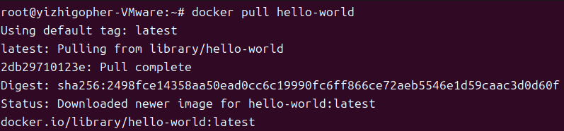
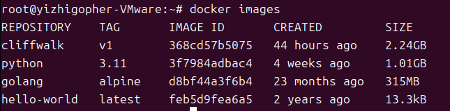
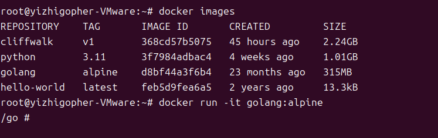

+++
title = 'docker常用命令介绍'
date = 2023-11-14T21:11:15+08:00
draft = false
pre='/introduce'
categories=['Docker']
+++

### 基本操作

在上节，我们已经安装好docker，但是就如同写代码一样，我们安装好了相关环境，但是并没有代码能够让我们运行，我们又不会写代码（自己构建镜像），那该怎么办。我们可以到github上面寻找一个相关的代码，拉取到本地，然后运行即可。

所以我们现在首先要做的事应该是学会如何拉取镜像到本地。

##### docker pull

完整的docker pull命令应该是：`docker pull ${IMAGE_NAME}:${IMAGE_TAG}`

它会从docker的官方镜像仓库中拉取对应的镜像。其中`${IMAGE_TAG}`部分如果不写，会默认拉取最新的镜像信息。

例如，我们现在运行`docker pull hello-world`命令，我们看看会发生什么：

我们能够看到，使用了最新的版本（tag），镜像的sha256验证信息，以及从哪里拉取的镜像。所以之后，如果我们需要某种镜像，我们就可以直接pull以下就可以了。

> 可以通过访问[docker hub](https://hub.docker.com)上，搜索你想要的基础镜像的信息即可（这一过程需要科学上网），或者使用`docker search ${IMAGE_NAME}`，实在不行利用bing搜索相关信息也是不错的选择

那么我们拉取完了，我们怎么能够确定这个镜像就是在我的电脑上的呢？

##### docker images

我们在控制台输入`docker images`看看会发生什么：

我们看到，在我们本地存储中，确确实实有一个来自`hello-world`，TAG是`latest`的仓库的镜像。

> 当然你也可以通过`docker inspect ${IMAGE_NAME}`查看镜像在本地的哪个位置，但是这么做完全没有必要。

我们已经能够确定确确实实有个镜像在本地，那么我们该如何运行这个镜像呢

##### docker run

完整的`docker run`指令如下：`docker run [OPTIONS] ${IMAGE_NAME} [COMMAND] [ARG...]`，这样之后会生成一个容器container

其中options常用的是：

- -v：绑定容器卷，后面紧跟映射关系，具体而言就是将本地文件和容器内的文件相关联。需要注意的是，两处的文件路径用`:`隔开，前面是本地文件的绝对路径，后面是容器内的绝对路径。例如：`docker run -v /home/yizhigopher/result:/project/result xxx:v1`

-  -d：后台运行容器，使用这个option后，我们就不会看到容器运行的结果，而只能看到一个容器ID

- -p：端口映射。有些时候，我们需要访问容器内的一些服务，例如MySQL容器，我们需要在本地就能连接容器中的MySQL服务，我们可以这么写：`docker run -d -p 8080:3306 mysql`，这样我们就是将容器内的3306端口映射到本地的8080端口，我们在本地就可以通过访问8080端口获得MySQL服务。

- -i：以交互模式运行容器，通常与 -t 同时使用

- -t：为容器重新分配一个伪输入终端，通常与 -i 同时使用

上述就是我们一般常用的OPTIONS信息，我们掌握了这些，基本可以应付大部分情况。如果需要其他的操作可以查阅官方文档，或者baidu。

举个例子：在终端执行`docker run -it golang:alpine`会发生什么：

需要注意的是我们这个命令相当于启动一个容器并进入容器内部