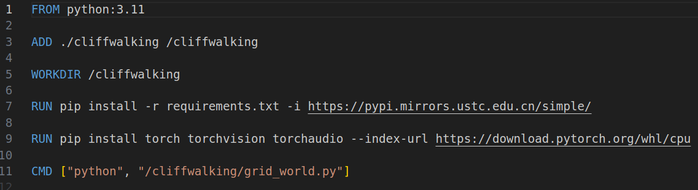
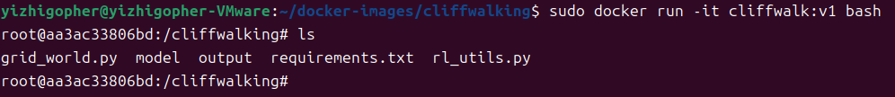

+++
title = 'docker常用命令以及镜像打包'
date = 2023-11-14T21:11:15+08:00
draft = false
pre='/introduce'
categories=['Docker']

+++

### 基本操作

在上节，我们已经安装好docker，但是就如同写代码一样，我们安装好了相关环境，但是并没有代码能够让我们运行，我们又不会写代码（自己构建镜像），那该怎么办。我们可以到github上面寻找一个相关的代码，拉取到本地，然后运行即可。

所以我们现在首先要做的事应该是学会如何拉取镜像到本地。

##### docker pull

完整的docker pull命令应该是：`docker pull ${IMAGE_NAME}:${IMAGE_TAG}`

它会从docker的官方镜像仓库中拉取对应的镜像。其中`${IMAGE_TAG}`部分如果不写，会默认拉取最新的镜像信息。

例如，我们现在运行`docker pull hello-world`命令，我们看看会发生什么：

我们能够看到，使用了最新的版本（tag），镜像的sha256验证信息，以及从哪里拉取的镜像。所以之后，如果我们需要某种镜像，我们就可以直接pull以下就可以了。

> 可以通过访问[docker hub](https://hub.docker.com)上，搜索你想要的基础镜像的信息即可（这一过程需要科学上网），或者使用`docker search ${IMAGE_NAME}`，实在不行利用bing搜索相关信息也是不错的选择

那么我们拉取完了，我们怎么能够确定这个镜像就是在我的电脑上的呢？

##### docker images

我们在控制台输入`docker images`看看会发生什么：

我们看到，在我们本地存储中，确确实实有一个来自`hello-world`，TAG是`latest`的仓库的镜像。

> 当然你也可以通过`docker inspect ${IMAGE_NAME}`查看镜像在本地的哪个位置，但是这么做完全没有必要。

我们已经能够确定确确实实有个镜像在本地，那么我们该如何运行这个镜像呢

##### docker run

完整的`docker run`指令如下：`docker run [OPTIONS] ${IMAGE_NAME} [COMMAND] [ARG...]`，这样之后会生成一个容器container

其中options常用的是：

- -v：绑定容器卷，后面紧跟映射关系，具体而言就是将本地文件和容器内的文件相关联。需要注意的是，两处的文件路径用`:`隔开，前面是本地文件的绝对路径，后面是容器内的绝对路径。例如：`docker run -v /home/yizhigopher/result:/project/result xxx:v1`

-  -d：后台运行容器，使用这个option后，我们就不会看到容器运行的结果，而只能看到一个容器ID

- -p：端口映射。有些时候，我们需要访问容器内的一些服务，例如MySQL容器，我们需要在本地就能连接容器中的MySQL服务，我们可以这么写：`docker run -d -p 8080:3306 mysql`，这样我们就是将容器内的3306端口映射到本地的8080端口，我们在本地就可以通过访问8080端口获得MySQL服务。

- -i：以交互模式运行容器，通常与 -t 同时使用

- -t：为容器重新分配一个伪输入终端，通常与 -i 同时使用

上述就是我们一般常用的OPTIONS信息，我们掌握了这些，基本可以应付大部分情况。如果需要其他的操作可以查阅官方文档，或者baidu。

举个例子：在终端执行`docker run -it golang:alpine`会发生什么：

需要注意的是我们这个命令相当于启动一个容器并进入容器内部。可以观察到，我们终端的位置发生了变化，从`root@yizhigopher`进入到了容器内部的`/go`目录下，由此也能看出docker的容器也可看成是一个小型的操作系统，在带有bash工具的容器内部，也可以执行一些简单的终端命令，例如`ls`、`cd`等等

既然我们已经学会了如何拉取镜像，如何启动一个容器，那么我们可以学学如何生成一个镜像。

### dockerfile

要实现自己编制一个镜像，我们就得学会dockerfile文件的编写规则。

当然，由于篇幅，这里仅仅提供一些简单的dockerfile文件编写的介绍，学会了这些也就够了，更多详细的说明都可以查看官方文档。

##### FROM ${IMAGE_NAME}

每个dockerfile都得以`FROM`作为开始，我们自己构建镜像，需要在一个镜像的基础上加以创作。就如同我们平时编写代码一样，我们不可能从0101二进制串来编写代码，我们会借助编译器等基础环境来高效编写程序。

`FROM ${IMAGE_NAME}`的意义十分简单，你可以简答地理解为`docker pull ${IMAGE_NAME}`，我们之后的一切操作都是在这个镜像内部执行的

##### WORKDIR ${FILE_NAME}

这个是自选的，`WORKDIR`相当于申明一个工作目录，当你的容器运行时，会默认在这个目录下运行。如果这个目录不存在，会自动帮你创建这个目录

##### COPY ${FILE_PATH} ${CONTAINER_FILE_PATH}

这个步骤会将本地主机下的`${FILE_PATH}`的内容拷贝到容器内部`${CONTAINER_FILE_PATH}`目录下。我们需要注意的是，如果你想拷贝一个文件，那么你需要指明这个文件在容器内部的名字，即：`COPY ./requirement.txt /project/req.txt`。如果你拷贝的是文件夹，那么你同样需要指明这个文件在容器内部的名称。

> 联系一下Linux系统下的mv指令，会有许多相同之处

需要注意的是，有一个`ADD`指令和`COPY`指令十分相似，执行的功能也大致相同，但是`ADD`会自动将压缩文件进行解压，而`MOVE`不行

##### RUN ${COMMAND}

这个命令会在搭建docker镜像时执行，它会执行`${COMMAND}`命令，通常我们用这条指令来为镜像内容进行修改。例如，我们为python代码进行打包时，会将python源代码`COPY`到镜像内部，然后会执行`RUN pip install -r requirements.txt`来安装相关包从而能够运行python代码

##### CMD ${COMMAND}

这个部分的命令会在容器启动时执行，需要注意的有几点

1. 你可以写多个CMD，但是只有最后一个CMD会执行
2. CMD的指令会被`docker run`附带的运行指令覆盖
3. COMMND的书写格式应写成字符数组的形式，例如`ls -a`需写成`["ls", "-a"]`

##### ENTRYPOINT ${COMMAND}

这个指令和`CMD`指令十分相似，但是有一点不同，`ENTRYPOINT`不会被`docker run`后的运行指令覆盖，而是会将`docker run`后面的参数传递给`ENTRYPOINT`。具体的示例可看这个博文[Docker从入门到精通——CMD与ENTRYPOINT区别](https://blog.csdn.net/wangwei021933/article/details/124369069)。这里就不再赘述。

ok我们大概介绍完了`dockerfile`需要了解的地方，现在我们来自己编写个dockerfile试试看吧。随便挑一个文件夹，将所需要的文件内容拷贝到这里，然后在这个文件夹下新建一个`dockerfile`文件（名字就是dockerfile），文件内容如下：

然后在这个文件夹下打开控制台，输入：`docker buuild -t cliffwalk:v1 .`

> docker build表示执行构建镜像
>
> -t表示构建的镜像名和镜像tag为cliffwalk:v1
>
> 最后的 . 表示使用当前目录下的dockerfile

会出现：

当指令结束后，我们使用`docker images`就可以看到构建好的镜像信息

由于我们最后使用的是`CMD`来表示容器运行的指令，所以，我们可以通过`docker run`的方式来覆盖这条指令来进入容器内部，我们能够看到在`/cliffwalking`目录下，有我们`COPY`进去的文件内容：

至此，我们完成了docker的基本命令和镜像打包的学习，最后一章我们会介绍如何高效的启动运行容器镜像
