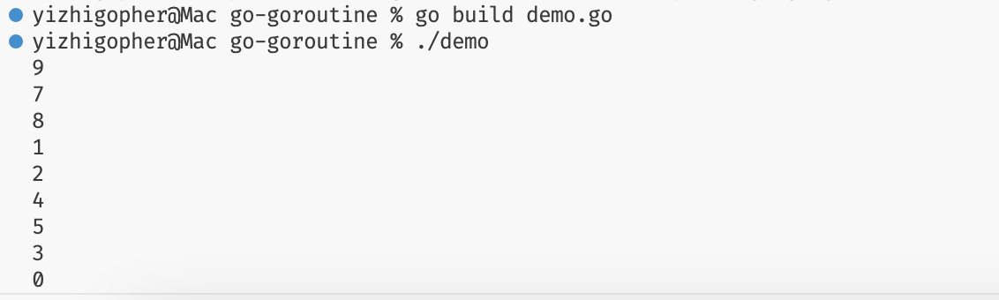

+++
title = 'Go并发'
date = 2025-01-04T14:17:12+08:00
categories = ["golang之路"]
tags = ["golang", "study"]
draft = false
+++
## 前置知识
1. 串行：指按照一定的顺序完成一组任务。例如会先清洗食材、再对食材切块备份、最后再进行烹饪
2. 并发：指**同一时间段**内，执行多个任务。比如：可以边刷电视剧，边刷课😎
3. 并行：指**同一时刻**，同时执行多个任务，比如：可以让你的冤种舍友帮你刷课，而你，我的朋友，你就可以专心致志的看电视剧了😜
4. 进程（process）：程序在操作系统中的一次执行过程，系统进行**资源分配和调度**的一个独立单位。
5. 线程（thread）：操作系统基于进程开启的轻量级进程，是操作系统**调度执行**的最小单位。
6. 协程（coroutine）：非操作系统提供而是由用户自行创建和控制的用户态‘线程’，比线程更轻量级。

了解这些术语，能够对之后Go并发有更加清晰的认识。
## goroutine
Goroutine是Go并发开发中最基础、最关键的一部分，大量Go程序都会由海量的goroutine构成，以实现并发。

goroutine是Go的核心，每个go程序至少会包含一个main goroutine，它会在程序启动时，自动创建。

在Go中，不需要自己实现进程、线程以及协程，当某个功能需要并发访问时，你只需要将其包装成一个函数，并开启一个goroutine执行这个函数就行了，以下是一个简单的开启goroutine实现并发的例子。
```go
package main

import (
	"fmt"
	"time"
)

func work(i int) {
	fmt.Println(i)
}

func main() {
	for i := 0; i < 10; i++ {
        // 创建10个协程，分别打印1～10数字
		go work(i)
	}
    // 等待2s，避免主协程过早结束
	time.Sleep(2*time.Second)
}
```
如上述例子，仅需要使用关键字`go`，并跟随一个函数，即可实现多协程，上述代码的执行结果是：


当使用`go`关键字，启动一个协程后，会交由Go运行时（runtime）进行调度，其中涉及到更加底层以及操作系统的知识，推荐大家阅读刘丹冰老师的这篇文章[^1]，其中全面的讲解了GMP模型以及协程调度逻辑，这里就不再详细展开了。

## channel
单纯创建多个协程在大多数情况下是没有意义的，如何能够在协程之间进行通讯，从而控制多个协程合作完成一项任务，才是并发追求的目标。但是在go中该如何实现协程之间的通讯呢？

go中采用通信共享而不是采用采用共享内存来实现通信，channel能够在不同的协程建立桥梁，以控制不同的协程。channel可以看作是一种队列，先进先出，仅仅起到一个通信的作用。首先，我们先来看看怎样定义和初始化channel
```go
var ch1 chan int
var ch2 chan struct{}

ch1 = make(chan int)
ch2 = make(chan struct{}, 10)
```
声明channel变量的格式为`var 变量名 chan 元素类型`。channel类型变量也得需要初始化后，才能使用，需要注意的是，channel采用make方法进行初始化，并可以设置其缓冲区的大小。
### channel接收和发送数据
在go中，采用箭头符号来实现对channel变量的数据传递，并采用`<-`实现对channel发送和接收数据的操作，举个例子：
```go
package main

import (
	"fmt"
	"time"
)

func work(ch chan int) {
	data, ok := <- ch
	if ok {
		fmt.Println(data)
		return
	}
	fmt.Println("channel is empty")
}

func main() {
	ch := make(chan int)
	go work(ch)
	ch <- 1
	time.Sleep(1 * time.Second)
}
```
当`<-`后跟随channel类型变量时，就是指从channel中接收数据；当`<-`后跟随channl元素类型一致的变量或数据时，表示向channel发送数据。
### 有缓冲和无缓冲channel之间的区别
无缓冲的通道又称为阻塞的通道，无缓冲的通道只有在有接收方**能够**接收值的时候才能发送成功，否则会一直处于**等待发送**的阶段。同理，如果对一个无缓冲通道执行接收操作时，没有任何向通道中发送值的操作那么也会导致接收**操作阻塞**。
使用无缓冲通道进行通信将导致发送和接收的`goroutine`同步化。因此，无缓冲通道也被称为同步通道。

只要通道的容量大于零，那么该通道就属于有缓冲的通道，通道的容量表示通道中最大能存放的元素数量。当通道内已有元素数**达到最大容量**后，再向通道执行发送操作就会**阻塞**，除非有从通道执行接收操作。

### 关闭channel
当向通道中发送完数据时，我们可以通过`close`函数来关闭通道。当一个通道被关闭后，再往该通道发送值会引发panic，从该通道取值的操作会先取完通道中的值。通道内的值被接收完后再对通道执行接收操作得到的值会一直都是对应元素类型的零值。并可以通过
```go
data, ok := <- chan // 当channel关闭了，ok为false，其余情况均为true
```
来判断channel是否关闭。

### for-range接收channel数据
如果需要通过轮询的方式来从channel中接收数据，通常是以这种方式来实现：
```go
func query(ch chan int) error {
    for {
        data, ok := <- ch
        if !ok {
            return errors.New("channel is closed!")
        }
        ...
    }
}
```
上述代码可以优化为这样，能够更加简洁，表达的意思也更加清晰：
```go
func query(ch chan int) error {
    for data, ok := range ch {
        if !ok {
            return errors.New("channel is closed!")
        }
        ...
    }
}
```

## select多路复用
有时会需要从多个channel中接收数据，这时，我们就可以采用select多路复用方式，它可以同时响应多个通道的操作。

`select`和`switch`相似，会有`case`和`default`分支，使用方法如下：
```go
for {
    select {
        case <-ch1:
            ...
        case data := <-ch2:
            ...
        case ch3 <- 3:
            ...
        default:
            ...
    }
}
```
Select 语句具有以下特点：
- 可处理一个或多个 channel 的发送/接收操作。
- 如果多个 case 同时满足，select 会**随机选择**一个执行。
- 对于没有 case 的 select 会一直**阻塞**，可用于阻塞 main 函数，防止退出。
- 如果存在default分支，且没有case分支满足，则会执行default分支的内容。

[^1]: [Golang调度器GPM原理与调度全分析——刘丹冰](https://zhuanlan.zhihu.com/p/323271088)