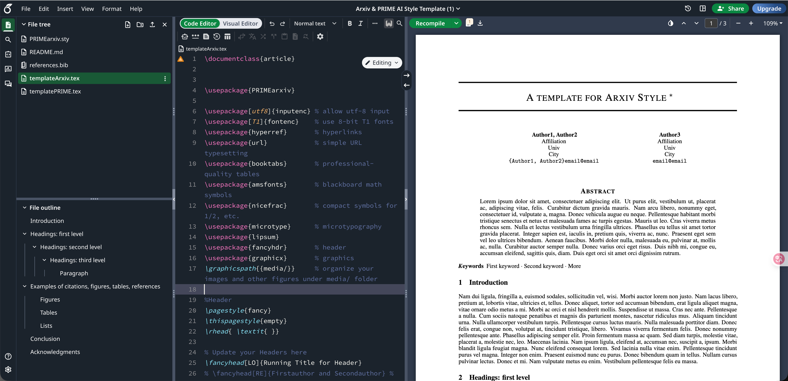

+++
title = 'LaTeX介绍'
date = 2025-12-26T15:18:59+08:00
draft = false
categories = ["LaTeX论文写作"]
tags = ["Latex", "论文基本功"]
+++
## 为啥要用LaTeX
为什么要专门再去学习一种“语言”来写论文，用word这种所见及所得的工具不好吗。其实就工具而言，本身并没有什么高下之分，不论用什么工具都能够写论文。只不过，由于本人苦于word调格式的麻烦久已，在插入mathtype公式、跨栏图片、跨栏表格以及交叉引用等等方面需要花费更多的时间对内容进行排布。因此本人会更加倾向于通过使用LaTeX来编写，如果你也觉着上述的这些问题也困扰你许久，不妨也来尝试用用LaTeX😊

## 什么是LaTex
先看看网上的介绍，巴拉巴拉～：
```
LaTeX 是一种基于 TeX 的排版系统，广泛用于生成高质量的科技和数学文档，由美国计算机科学家 Leslie Lamport 在 20 世纪 80 年代开发。

TeX 是由 Donald Knuth 开发的底层排版引擎，主要用于处理复杂的数学公式和高质量的排版。

LaTeX 在 TeX 的基础上提供了更高层次的抽象，使得用户可以更专注于内容，而无需过多担心排版细节。

与常见的文字处理软件（如 Microsoft Word）不同，LaTeX 使用纯文本文件来描述文档的结构和内容，并通过编译生成最终的 PDF 文件。LaTeX 特别适合处理复杂的数学公式、参考文献、交叉引用等。
```
在我看来，LaTeX就像一种代码语言，能够通过这些代码，定义好文档中的文字、图片、表格、格式。

## 怎么用🤔
一般情况下，如果在本地搭建LaTeX环境（既然是一种语言，那就会需要有对应的编译环境）是比较麻烦的。因此，可以选用目前本人使用较多的一种在线LaTeX网站[Overleaf](https://cn.overleaf.com/project)，在这个网站上，可以直接创建一个项目（对应一个文章）。这个网站的[优点](https://zhuanlan.zhihu.com/p/67182742)极多，不仅能够免费使用，而且常用的package都能够使用，不需要再额外苦哈哈的去到处找。


注册好后，就能进入这个平台的界面，在这里可以通过选择一个zip文件来新建一个项目，编写对应期刊社的论文内容了。
> 期刊社一般会提供zip文件，在这个压缩包中，期刊社会定义好论文的基本格式，因此可以直接编写论文内容即可。

### 期刊社模板怎么下载：
目前主流的期刊社有如下这些：
- IEEE提供了一个模板下载[网站](https://template-selector.ieee.org/secure/templateSelector/publicationType)，在这个网站上可以选择是期刊文章、会议文章，以及可以选择对应的期刊等等
- Elsevier提供了一个LaTeX说明[网站](https://www.elsevier.com/researcher/author/policies-and-guidelines/latex-instructions)，可以下载Elsevier对应的模板
- Wiley提供了一个期刊模板的下载[网页](https://authorservices-ppd.wiley.com/author-resources/Journal-Authors/Prepare/new-journal-design.html)，可以使用该模板

关于上述的这些模板，需要补充说明几点：
- Elsevier以及Wiley期刊社提供的模板中，能够选择两种（单栏和双栏），可以按需使用
- Elsevier提供的模板有许多需要再手动修改格式部分，可以参考这个[博客](https://zhuanlan.zhihu.com/p/1900635480392959257)对格式进行调整
- Wiley提供的模板有一个比较大的bug，需要首先删去项目中的`listings.sty`，并且需要将`WileyNJDv5.cls`中第355～第356行给注释掉才能通过编译

## 基本介绍：
在这里，将借助overleaf上提供的[arxiv模板](https://www.overleaf.com/latex/templates/arxiv-and-prime-ai-style-template/qdnhqytdqzsc)对latex中的各个元素进行基本说明。不同期刊下的模板中，部分写法会有所不同，之后会单独对IEEE以及Elsevier进行说明

其中左侧陈列了项目的文件，包括：
- PRIMEarxiv.sty（格式文件，定义了文中的字体，缩进，行间距，段间距等等）
- references.bib（参考文献，文中所采用的参考文献都可以放在这里）
- *.tex（内容文件，在这个文件中，可以编写论文内容，并通过编译后，能在右侧显示对应的内容）

我们主要关注这个tex文件，接下来就对这个部分的内容进行说明

### 文类定义
首先该文件申明了这个文件类型，一般会有article，report，beamer……
```
\documentclass{article}
```
一般情况下不需要太多关注这个，如果想要有更深入的了解，可以参考这个[博客](https://blog.csdn.net/PolarisRisingWar/article/details/136135434)

### 导言区
之后我们可以看到许多“引包”指令：
```
\usepackage{PRIMEarxiv}

\usepackage[utf8]{inputenc} % allow utf-8 input
\usepackage[T1]{fontenc}    % use 8-bit T1 fonts
\usepackage{hyperref}       % hyperlinks
\usepackage{url}            % simple URL typesetting
\usepackage{booktabs}       % professional-quality tables
\usepackage{amsfonts}       % blackboard math symbols
\usepackage{nicefrac}       % compact symbols for 1/2, etc.
\usepackage{microtype}      % microtypography
\usepackage{lipsum}
\usepackage{fancyhdr}       % header
\usepackage{graphicx}       % graphics
\graphicspath{{media/}}     % organize your images and other figures under media/ folder

%Header
\pagestyle{fancy}
\thispagestyle{empty}
\rhead{ \textit{ }} 

% Update your Headers here
\fancyhead[LO]{Running Title for Header}
% \fancyhead[RE]{Firstauthor and Secondauthor} % Firstauthor et al. if more than 2 - must use \documentclass[twoside]{article}
```
主要作用是对文档的性质做一些设置，或者自定义一些命令，这些包的作用大多是用来显示图片、公式等等。如果后续需要添加其他的package，就需要在这边补充，比如常用的：
- subfig：用于呈现子图
- changes：用于论文内容修改，高亮显示修改的地方
- algorithm2e：用于在论文中插入算法伪代码
- ……

### 标题、作者
之后，可以定义论文的作者，标题以及致谢部分内容，从这里开始就可以对模板内容进行修改了
```
%% Title
\title{A template for Arxiv Style
%%%% Cite as
%%%% Update your official citation here when published 
\thanks{\textit{\underline{Citation}}: 
\textbf{Authors. Title. Pages.... DOI:000000/11111.}} 
}

\author{
  Author1, Author2 \\
  Affiliation \\
  Univ \\
  City\\
  \texttt{\{Author1, Author2\}email@email} \\
  %% examples of more authors
   \And
  Author3 \\
  Affiliation \\
  Univ \\
  City\\
  \texttt{email@email} \\
  %% \AND
  %% Coauthor \\
  %% Affiliation \\
  %% Address \\
  %% \texttt{email} \\
  %% \And
  %% Coauthor \\
  %% Affiliation \\
  %% Address \\
  %% \texttt{email} \\
  %% \And
  %% Coauthor \\
  %% Affiliation \\
  %% Address \\
  %% \texttt{email} \\
}
```
可以看到这部分可以定义作者名，单位，地址，邮箱等等，不同的模板，这部分的写法会有所差异。

### 正文
正文部分定义在如下代码块中：
```
\begin{document}
\maketitle %%显示标题和作者

\begin{abstract} %% 定义摘要部分的内容
\lipsum[1] %% 可以将这段生成随机字符的指令换成论文的摘要内容
\end{abstract}
...
\end{document}
```
接下来就是论文的各个章节了，从这里开始，我们将对论文中会涉及到的各个组成部分单独进行说明
#### 标题
采用`\section{xxx}`，`\subsection{xxx}`，`\subsubsection{xxx}`来定义一级标题、二级标题、三级标题（最多就三级标题）。花括号中就是标题内容

#### 书签
采用`\label{xxx}`定义书签位置，花括号中一般是书签名，本人一般会采用如下这样的命名方式：
- `sec: xxx`用于在标题处定义一个书签
- `tab: xxx`用于在表格处定义书签
- `fig: xxx`用于在图处定义书签
- `eq: xxx`用于在公式处定义书签

#### 交叉引用
交叉引用分为两种，一种是`\ref{}`（这个用来引用书签），另一种是`\cite{}`（这个引用参考文献）。对于`\ref{}`，花括号中写书签名即可。对于`\cite{}`，花括号中写`*.bib`文件中定义的文献名，具体例子可以参考如下：
其中，`*.bib`文件中：
```
……
@inproceedings{kour2014real, // 这个就是参考文献名
  title={Real-time segmentation of on-line handwritten arabic script},
  author={Kour, George and Saabne, Raid},
  booktitle={Frontiers in Handwriting Recognition (ICFHR), 2014 14th International Conference on},
  pages={417--422},
  year={2014},
  organization={IEEE}
}
……
```
`.tex`文件中的内容为：
```
\begin{document}
\section{Introduction}\label{sec: 1}
...
...As Section\ref{sec: 1} shown, ...
Kour et.al\cite{kour2014real} proposed ...
...
\end{document}
```

#### 参考文献
在正文最后，会定义参考文献内容，引用格式模板会定义好，因此只需指明参考文献的名称即可：
```
\begin{document}
...
%Bibliography
\bibliographystyle{unsrt} %% 定义了参考文献的格式
\bibliography{references} %% 指明参考文献名，需要和项目文件中的bib文件同名
\end{document}
```
这样在文中引用的参考文献，会自动按照定义的引用格式自动排列参考文献。

#### 公式
公式需要用latex语法进行编写，这部分内容多而繁杂，之后会单独进行说明
> 现在是人工智能时代了，可以写一个公式或者截图，让AI写对应的latex表达式
```
\begin{equation}
\xi _{ij}(t)=P(x_{t}=i,x_{t+1}=j|y,v,w;\theta)= {\frac {\alpha _{i}(t)a^{w_t}_{ij}\beta _{j}(t+1)b^{v_{t+1}}_{j}(y_{t+1})}{\sum _{i=1}^{N} \sum _{j=1}^{N} \alpha _{i}(t)a^{w_t}_{ij}\beta _{j}(t+1)b^{v_{t+1}}_{j}(y_{t+1})}}
\label{eq: 1} %%如果需要引用，就得加一个label
\end{equation}
```

#### 图片
arxiv的模板中，对于图片是生成的，这里我采用别的一段代码：
```
\begin{figure}[htbp]
    \centering
    \includegraphics[width=1\linewidth]{media/architecture/xxx.pdf} %% 花括号中写该图片在项目中的位置，[]包裹的是控制图片大小，一般只需要修改这个数字就行
    \caption{momoengegioqg} %% 这个是图片的题注
    \label{fig:background1}
\end{figure}
```
如果你想要的你的图片跨栏，可以这样子，加个星号就行：
```
\begin{figure*}[htbp]
    ……
\end{figure*}
```

#### 表格
表格的定义如下：
```
\begin{table}
 \caption{Sample table title}
  \centering
  \begin{tabular}{lll}
    \toprule
    \multicolumn{2}{c}{Part}                   \\
    \cmidrule(r){1-2}
    Name     & Description     & Size ($\mu$m) \\
    \midrule
    Dendrite & Input terminal  & $\sim$100     \\
    Axon     & Output terminal & $\sim$10      \\
    Soma     & Cell body       & up to $10^6$  \\
    \bottomrule
  \end{tabular}
  \label{tab:table}
\end{table}
```
`\toprule`，`\midrule`，`\bottomrule`用于显示三线表的线，一般情况下，`\toprule`紧跟在`\begin{tabular}`后，`\midrule`在表头后，`\\`用于选择换行，`\bottomrule`放在最后。

这里推荐一个[在线网站](https://www.tablesgenerator.com/)，你可以在本地excel编写好内容后，复制对应的表格，然后粘贴就能生成对应的代码


如果需要表格跨栏，也是加个星号就行。

#### 列表
一般会采用两种列表，一种是有序列表：
```
\begin{enumerate}
\item xxx
\item yyy
\item zzz
\end{enumerate}
```
另一种是无序列表：
```
\begin{itemize}
\item xxx
\item yyy
\item zzz
\end{itemize}
```

至此关于LaTeX的介绍已经基本结束，可以去overleaf上尝试下，开始自己的LaTeX之旅吧