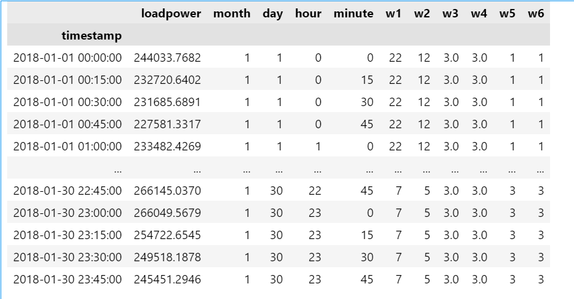

+++
title = 'Normalizing Flow介绍'
date = 2024-01-06T14:08:15+08:00
draft = false
+++

### 归一化流基本内容

**什么是标准化流**：基于一系列可逆变换，生成样本对应的分布

**标准化流的基本原理**：

- 变量替换：$p_x(x)=p_z(f_\theta(x))|\det J_{f_\theta}(x)|$，我们可以理解为通过$z=f_\theta(x)$，将原先复杂分布，变换成简单易懂的分布形式，其中我们要求$f_\theta$必须是可逆变换。标准化流的目的就是求得该可逆变换。
  
  > 在标准化流中，往往会使用多个这样的可逆变换，即$f_\theta(x)=f_1(x)\circ f_2(x)...\circ f_K(x)$

- 雅各比行列式求解：
  
  $$
  \det J_{f_\theta}(x)=\det \prod_{i=1}^K J_{f_i}(x)=\prod_{i=1}^K\det J_{f_i}(x)
  $$
  
  利用对数函数，我们可以得到：
  
  $$
  \log p_x(x)=\log p_z(f_{\theta}(x))+\sum_{i=1}^K\log |det J_{f_i}(x)|
  $$
  
  我们需要最大化这个概率密度

### 论文《A deep generative model for probabilistic energy forecasting in power systems: normalizing flows》的应用：

在该论文中，作者采用标准化流的方式实现了负荷预测功能。作者利用$\bm x$表示d-1天的负荷数据，用$\bm c$表示天气信息，希望能够得到符合符合数据分布的分布$p_\theta(\bm x|\bm c)$，从而可以利用该分布得到预测数据$\^{\bm x}$。

在利用归一化流方式对泰迪比赛数据进行负荷预测的尝试中，会进行如下操作：

提取时间数据和天气数据，重新整合原本数据格式，得到归一化流的模型输入格式

其中每一行为某个时刻的负荷数据y和影响负荷的因素（时间因素、天气因素）x。根据日期重新排列数据x，将每个时刻影响负荷的因素横向排列并组合。此时x重新排列为一个$day\times 960$的矩阵，表现如下：
