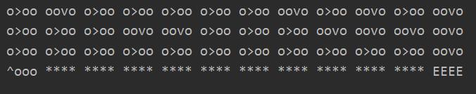

+++
title = 'DQN算法示例：CliffWalking问题'
date = 2023-11-10T20:48:46+08:00
draft = false
tags=['pytorch', 'DQN', 'RL']
categories=["机器学习之路"]

+++
### 问题描述

给定一个4×12的网格环境，如下图所示，其中黄色区域表示悬崖，我们不能经过，蓝色是我们的目标区域，我们希望能求出每个状态如何利用最少的步骤到达目的点。


### 编写工具类代码

```python
# rl_utils.py
def one_hot(index, num_size=10):
    return [1 if i == index else 0 for i in range(num_size)]

class ReplayBuffer:
    def __init__(self, capacity):
        self.buffer = collections.deque(maxlen=capacity)

    def add(self, state, action, reward, next_state, done):
        self.buffer.append((state, action, reward, next_state, done))

    def sample(self, batch_size):
        transitions = random.sample(self.buffer, batch_size)
        state, action, reward, next_state, done = zip(*transitions)
        return np.array(state), action, reward, np.array(next_state), done

    def size(self):
        return len(self.buffer)

def train_off_policy_agent(env, agent, num_episodes, replay_buffer, minimal_size, batch_size):
    return_list = []
    for i in range(10):
        with tqdm(total=int(num_episodes / 10), desc='Iteration %d' % i) as pbar:
            for i_episode in range(int(num_episodes / 10)):
                episode_return = 0
                state = env.reset()[0]
                done = False
                while not done:
                    action = agent.take_action(state)
                    next_state, reward, done, _, _ = env.step(action)
                    replay_buffer.add(state, action, reward, next_state, done)
                    state = next_state
                    episode_return += reward
                    if replay_buffer.size() > minimal_size:
                        b_s, b_a, b_r, b_ns, b_d = replay_buffer.sample(batch_size)
                        transition_dict = {'states': b_s, 'actions': b_a, 'next_states': b_ns, 'rewards': b_r,
                                           'dones': b_d}
                        agent.update(transition_dict)
                return_list.append(episode_return)
                if (i_episode + 1) % 10 == 0:
                    pbar.set_postfix({'episode': '%d' % (num_episodes / 10 * i + i_episode + 1),
                                      'return': '%.3f' % np.mean(return_list[-10:])})
                pbar.update(1)
    return return_list

```

### 制定规则

我们规定，每走一步所得的reward是-1，走进悬崖的reward是-100，到达目标地点的reward是100。

我们编写环境代码如下：

```python
# grid_world.py
class GridWorld:
    """ 悬崖问题的环境建立 """

    def __init__(self, row=4, col=12):
        self.action_num = 4
        self.col = col
        self.row = row
        self.x = row - 1
        self.y = 0
        self.statue_dim = self.row*self.col
        self.action_dim = 4

    def step(self, action) -> (list, float, bool, bool, dict):
        action = int(action)
        # 假设一个3*3的情景，目的是中间方块，求最短距离
        self.x = min(self.row - 1, max(0, self.x + change[action][0]))
        self.y = min(self.col - 1, max(0, self.y + change[action][1]))
        next_state = self.x * self.col + self.y
        reward = -1
        done = False
        if self.x == self.row - 1 and self.y > 0:
            done = True
            if self.y != self.col - 1:
                # enter into hole
                reward = -100
            else:
                # reach the final
                reward = 100

        nextState = np.array(rl.one_hot(next_state, num_size=self.row * self.col))
        return nextState, reward, done, False, {}

    def reset(self) -> (list, dict):
        self.x = self.row - 1
        self.y = 0
        label = self.x * self.col + self.y
        state = np.array(rl.one_hot(label, num_size=self.row * self.col))
        return state, {}

```

在上述代码中，我们实现了环境的定义，同时，我们注意到，我们返回的状态采用了独热编码，这也就意味着，之后我们构建网络时，输入的维度应该是48。

### 编写神经网络用来拟合QSA target

我们需要知道，这个网络的输入是48，输出应该是action个数。

```python
# grid_world.py
class CliffWalkNet(nn.Module):
    """ 悬崖问题神经网络构造 """

    def __init__(self, in_dim, hidden_dim, out_dim):
        super(CliffWalkNet, self).__init__()
        self.layer = nn.Sequential(
            nn.Linear(in_dim, hidden_dim),
            nn.ReLU(),
            nn.Linear(hidden_dim, hidden_dim),
            nn.ReLU(),
            nn.Linear(hidden_dim, out_dim)
        )

    def forward(self, x):
        return self.layer(x)
```

在里面使用三个全连接层，以及两个隐藏层。

### 编写DQN核心代码

我们每个动作采用ε贪婪策略，以及规定每次操作执行的更新方法

```python
class CliffWalkDQLearning:
    def __init__(self, in_dim, hidden_dim, action_dim):
        self.ActionNumber = action_dim
        self.Q_net = CliffWalkNet(in_dim, hidden_dim, action_dim).to(device)
        self.Q_target = CliffWalkNet(in_dim, hidden_dim, action_dim).to(device)
        self.optimizer = torch.optim.Adam(self.Q_net.parameters(), lr=learning_rate)
        self.criterion = nn.MSELoss()
        self.count = 0
        self.QSA = [[0, 0, 0, 0] for _ in range(in_dim)]

    def take_action(self, state):
        if np.random.random() < epsilon:
            return np.random.randint(self.ActionNumber)
        state = torch.tensor(state, dtype=torch.float).to(device)
        return self.Q_net(state).argmax().item()

    def update(self, transition: dict):
        # load data from dictionary
        states_ = torch.tensor(transition.get("states"), dtype=torch.float).to(device)
        actions_ = torch.tensor(transition.get("actions")).view(-1, 1).to(device)
        rewards_ = torch.tensor(transition.get("rewards"), dtype=torch.float).view(-1, 1).to(device)
        next_states_ = torch.tensor(transition.get("next_states"), dtype=torch.float).to(device)
        dones_ = torch.tensor(transition.get("dones"), dtype=torch.float).view(-1, 1).to(device)

        q_values = self.Q_net(states_).gather(1, actions_)  # 每列收集对应actions_拟合的value值
        max_qvalue = self.Q_target(next_states_).max(1)[0].view(-1, 1)
        q_target = rewards_ + gamma * max_qvalue * (1-dones_)
        loss = self.criterion(q_values, q_target)
        self.optimizer.zero_grad()
        loss.backward()
        self.optimizer.step()
        if self.count % update_times == 0:
            net_state_dict = self.Q_net.state_dict()
            self.Q_target.load_state_dict(net_state_dict)
        self.count += 1

```

### 执行代码，进行模型训练

我们可以直接利用rl_utils里面的（off_policy）工具，进行DQN的训练

```python
	env = GridWorld()
    dim = env.row*env.col
    agent = CliffWalkDQLearning(in_dim=dim, hidden_dim=int(dim/2), action_dim=4)
    buffer = rl.ReplayBuffer(1000)
    random.seed(0)
    np.random.seed(0)
    torch.manual_seed(0)
    return_list = rl.train_off_policy_agent(env, agent, num_episodes, buffer, minimal_size, batch_size)
    episodes_list = list(range(len(return_list)))
    plt.plot(episodes_list, return_list)
    plt.xlabel('Episodes')
    plt.ylabel('Returns')
    plt.title('DQN on {}'.format("Cliff Walking"))
    plt.show()
```

### 模型保存

```python
  	torch.save({"CliffWalking": agent.Q_target.state_dict()}, "./cliff_walking.pth")
	# load model
    model = CliffWalkNet(in_dim=dim, hidden_dim=int(dim/2), out_dim=4).to(device)
    state_dict = torch.load("./cliff_walking.pth")["CliffWalking"]
    model.load_state_dict(state_dict)

    res = [[0, 0, 0, 0] for _ in range(dim)]
    for i in range(4):
        for j in range(12):
            state = rl.one_hot(i*12+j, dim)
            input_ = torch.tensor(state, dtype=torch.float).to(device)
            target = model(input_).cpu().detach().numpy().tolist()
            res[i*12+j] = target
            # print("state(%d,%d):" % (i, j))
            # print(target)
        # print()
    print_agent(res, env, action_graph, list(range(37, 47)), [47])
```

我们将训练好的模型保存，之后导入model，这样我们就可以避免重复的模型训练，直接计算每个结点的QSA，寻找每个状态的action最大值，从而得出训练后的策略结果。



由上述结果，我们发现每个状态都已经找到了最优的策略，这个模型的结果还算可以。
