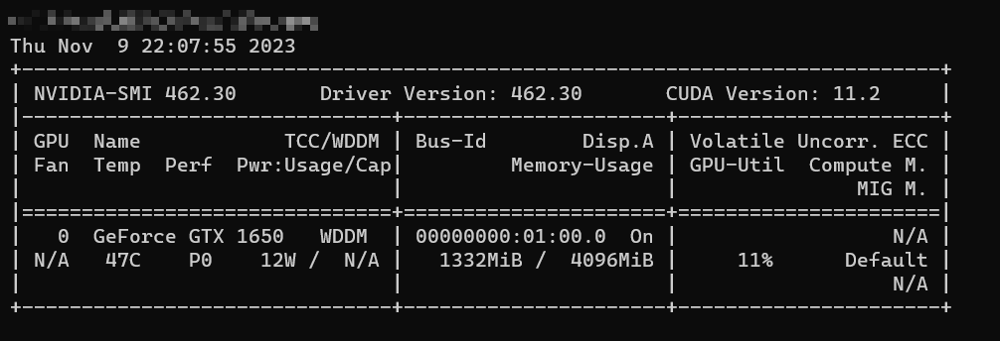
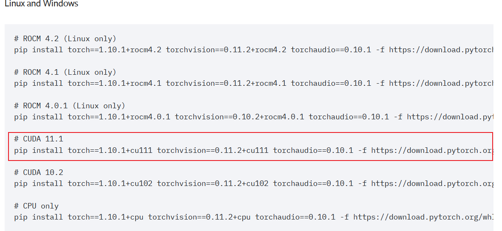

+++
weight=2
title = 'pytorch实现线性拟合'
date = 2023-11-09T21:59:54+08:00
draft = false
tags=["pytorch", "mechine learning"]
categories=["机器学习之路"]

+++
### 安装pytorch
我们以英伟达显卡为例，我们需要知道自己电脑对应cuda版本信息：
> 在控制台输入nvidia-smi我们可以看到对应cuda版本的信息内容：



从上图中，我们可知：当前我们CUDA的版本是11.2，之后我们去[pytorch官方网页](https://pytorch.org/)查询对应pytorch的版本信息，按照给出的安装命令信息安装即可。



> 由于pytorch官网并没有cuda11.2的安装方法，所以我选择安装cuda11.1的环境
>
> ```shell
> pip install torch==1.9.1+cu111 torchvision==0.10.1+cu111 torchaudio==0.9.1 -f https://download.pytorch.org/whl/torch_stable.html
> ```

我们可以通过一下代码来判断pytorch是否已经正确安装以及识别到显卡驱动

```python
import torch

print(torch.cuda.is_available())
print(torch.cuda.current_device())
print(torch.cuda.device_count())
print(torch.cuda.get_device_name(0))
```
执行结果如下：


### 编写代码

现在我们可以进行代码编写过程了

1. 构造数据集，我们假设拟合的结果是
   $$
   y=w_1\times x_1 + w_2\times x_2 + b\\\\
   即y=\begin{bmatrix}
   w_1 & w_2 \\\\
   \end{bmatrix}
   \begin{bmatrix}
   x_1\\\\
   x_2\\\\
   \end{bmatrix}+b
   $$
   为了能够体现机器学习拟合的有效性，我们在生成数据点时会增加一些噪声，从而体现出数据的混乱

2. 代码实现：

   ```python
   def synthetic_data(w, b, num_examples):
       """生成 y = Xw + b + 噪声。"""
       X = torch.normal(0, 1, (num_examples, len(w)))  # X是均值为0，方差为1的随机数。有num_examples个样本，列就是len(w)
       y = torch.matmul(X, w) + b  # Y是X与w的乘积（matmul == mm，矩阵相乘）加上偏差b
       y += torch.normal(0, 0.01, y.shape)  # 加入一个噪音，均值为0，方差为0.01，形状与y相同
       return X, y.reshape((-1, 1))  # 其中，y返回一个列向量。-1表示自动计算，1表示固定，即列向量为1
   
   true_w = torch.tensor([2, -3.4])
   true_b = 4.2
   features, labels = synthetic_data(true_w, true_b, 1000)
   ```
   我们可以绘制图像，用于显示我们构造的数据：

   

   然后我们将数据进行封装成Dataset

   ```python
   class LinearDataSet(Dataset):
       def __init__(self, x, y):
           self.X = torch.FloatTensor(x)
           self.Y = torch.FloatTensor(y)
   
       def __getitem__(self, index):
           return self.X[index], self.Y[index]
   
       def __len__(self):
           return len(self.X)
       
   trainSet = LinearDataSet(features, labels)
   trainLoader = DataLoader(trainSet, batch_size=10, shuffle=True, pin_memory=True)
   ```

3. 我们现在编写网络，以及编写一个训练过程：

   ```python
   class LinearNetWork(nn.Module):
       def __init__(self, n_feature):
           super(LinearNetWork, self).__init__()
           self.layers = nn.Sequential(
               nn.Linear(n_feature, 1)  # 定义一个最简单线性全连接层
           )
   
       def forward(self, x):
           y = self.layers(x)
           return y
       
   def Trainer(train_loader: DataLoader, model: LinearNetWork):
       criterion = nn.MSELoss()  # 定义一个均方误差
       optimizer = torch.optim.SGD(model.parameters(), lr=0.03)  # 定义一个优化器
       for i in range(epoch):
           model.train()
           for x, y in train_loader:
               optimizer.zero_grad()  # 采用梯度下降，每次训练都需要将梯度信息清零
               x, y = x.to(device), y.to(device)
               pred = model(x)
               loss = criterion(pred, y)
               print("loss=", loss.detach().item())
               loss.backward()  # 梯度回退
               optimizer.step()
   
   model = LinearNetWork(2).to(device)  # 因为我们总共就两个变量，所以我们传入的特征信息为2
   Trainer(trainLoader, model)
   print(model.state_dict())
   ```

   这样我们一个最简单的神经网络已经构成，我们执行上述代码查看网络每层的信息：

   

### 总结

总的来说，这次这个任务还是比较简单的，我们构造一个简单的神经网络，完成了最简单的线性拟合的问题，我们可以在这里面一窥机器学习的基本过程。我们需要获取数据、数据处理、构造网络、进行训练、调整参数，然后不断循环往复，从而得到一个加好的结果。
