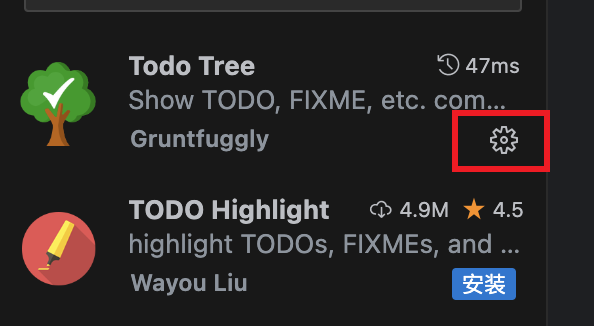
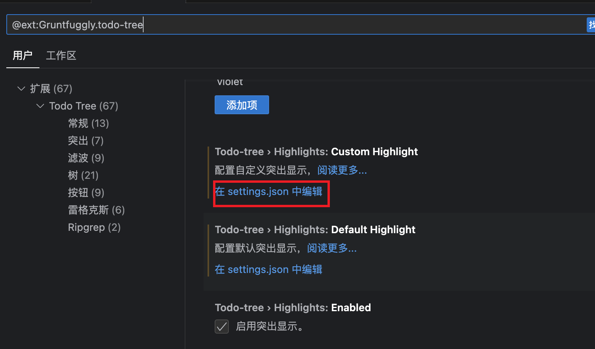

+++
weight = 1
title = "Todotree插件设置"
date = 2024-01-22T14:48:37+08:00
draft =  false
tags = ["vscode", "extension"]
categories = ["vscode插件配置设置"]
+++

在插件中找到Todo Tree，点击设置按钮



找到在`settings.json`中编辑更多



将上述代码复制到`settings.json`中即可。
```json
    "todo-tree.regex.regex": "((%|#|//|<!--|^\\s*\\*)\\s*($TAGS)|^\\s*- \\[ \\])",
    "todo-tree.regex.regexCaseSensitive": false,
    "todo-tree.general.tags": [
        "BUG",
        "HACK",
        "FIXME",
        "TODO",
        "todo",
        "bug",
        "tag",
        "done",
        "mark",
        "test",
        "update",
        "[]",
        "[x]"
    ],
    "todo-tree.highlights.defaultHighlight": {
        "background": "#ff9100",
        "foreground": "#ffffff",
        "type": "text",
        "icon": "bug"
    },
    "todo-tree.highlights.customHighlight": {
        //todo 		需要做的功能
        "todo": {
            "icon": "alert", //标签样式
            "background": "#c9c552", //背景色
            "rulerColour": "#c9c552", //外框颜色
            "iconColour": "#c9c552", //标签颜色
        },
        //bug		必须要修复的BUG  
        "bug": {
            "background": "#ff3737",
            "icon": "bug",
            "rulerColour": "#eb5c5c",
            "iconColour": "#eb5c5c",
        },
        //tag		标签
        "tag": {
            "background": "#38b2f4",
            "icon": "tag",
            "rulerColour": "#38b2f4",
            "iconColour": "#38b2f4",
            "rulerLane": "full"
        },
        //done		已完成
        "done": {
            "background": "#328050",
            "icon": "check",
            "rulerColour": "#5eec95",
            "iconColour": "#5eec95",
        },
        //mark     	标记一下
        "mark": {
            "background": "#f90",
            "icon": "note",
            "rulerColour": "#f90",
            "iconColour": "#f90",
        },
        //test		测试代码
        "test": {
            "background": "#df7be6",
            "icon": "flame",
            "rulerColour": "#df7be6",
            "iconColour": "#df7be6",
        },
        //update  	优化升级点
        "update": {
            "background": "#b14e75",
            "icon": "versions",
            "rulerColour": "#d65d8e",
            "iconColour": "#d65d8e",
        },
    },
```