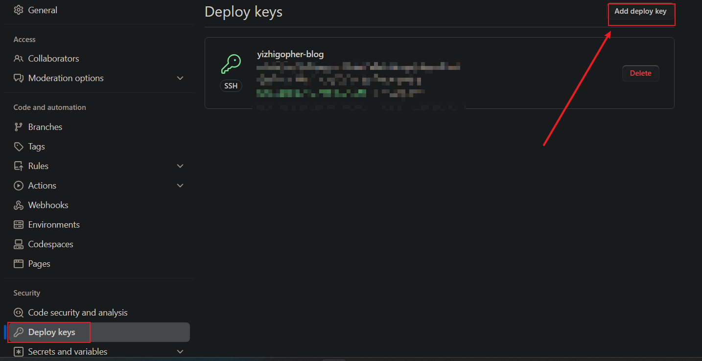
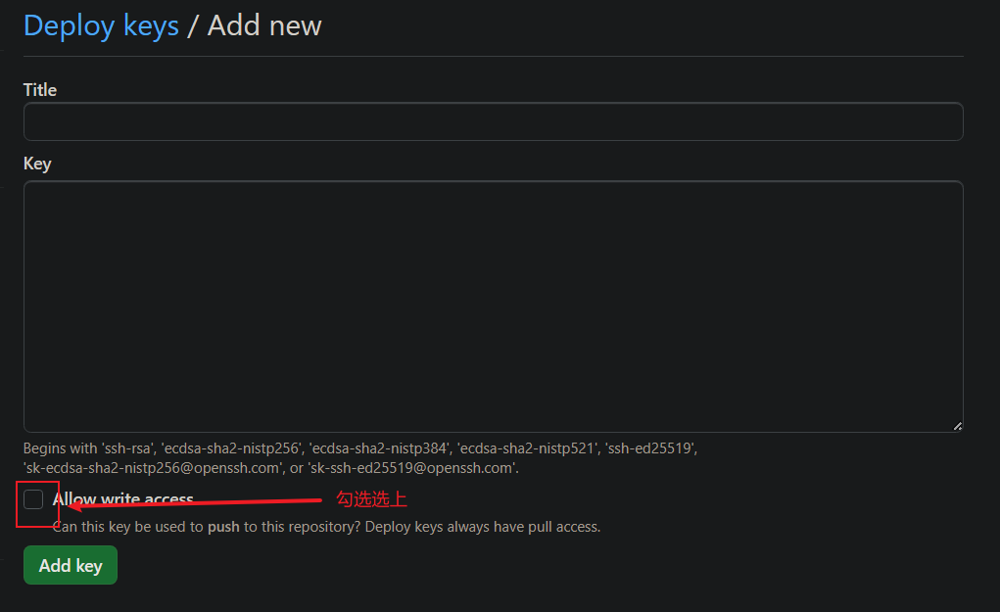

+++
weight=1
title = '如何利用GitHub的Action实现hugo项目自动化部署'
author='yizhigopher'
date = 2023-11-12T15:39:14+08:00
draft = false
tags=['github', '自动化部署']
categories=['Hugo']
+++
### 为什么要用Action来实现自动化部署hugo项目

- 不采用自动化部署，每次更新项目时，都需要在本地编译，然后上传整个public目录，比较麻烦
- 不采用自动化部署，没办法管理博客内容以及维护

### 怎样实现

在github上创建 {{ username }}.github.io仓库，在main分支的基础上，新建source分支用于存放hugo的markdown文件，而main分支用于存放编译好后的文件

- 前期准备：

    在本地，使用ssh工具创建公私钥

    `ssh-keygen -t rsa -N '' -f ./deploy-key -q`

    在本地我们会得到`deploy-key`和`deploy-key.pub`两个文件

    现在需要将ssh密钥信息设置到仓库中：

    - 添加deploy-key信息

      

      

      deploy key的title随便填写即可，我们将生成的deploy-key.pub（即公钥）的内容填到key中

    - 设置action的密钥：

      新建一个actions secret

      

      

      其中Name的内容填为`ACTIONS_DEPLOY_KEY`，Secret的内容填为我们生成的deploy-key（即私钥）的内容。

- 在source分支中添加.github/workflows/main.yml文件，用于定义Github Actions，其中main.yaml文件内容为

    ```yaml
    name: auto-update-page # 定义action名称
    
    on:
      push:
        branches:
          - source # 当source分支出现push行为时，执行这个action
    
    jobs:
      deploy:
        runs-on: ubuntu-22.04 # 定义环境以及之后的行为
        steps:
          - uses: actions/checkout@v4
            with:
              submodules: true # Fetch Hugo themes (true OR recursive)
              fetch-depth: 0 # Fetch all history for .GitInfo and .Lastmod
    
          - name: Setup Hugo
            uses: peaceiris/actions-hugo@v2
            with:
              hugo-version: "0.120.3"
              extended: true
    
          - name: Build
            run: hugo --minify
    
          - name: Deploy
            uses: peaceiris/actions-gh-pages@v3
            with:
              deploy_key: ${{ secrets.ACTIONS_DEPLOY_KEY }}
              publish_dir: ./public
              external_repository: plutolove233/plutolove233.github.io
              publish_branch: main  # 将编译好的public里面的内容部署到对应仓库的分支上
    ```

	设置完之后，我们查看仓库的Actions，我们能够看到： 


看到如上内容，就意味着我们自动化部署的工作流完成了，我们可以尝试修改部分markdown文件，上传之后我们可以看到我们的博客内容也会发生改变
