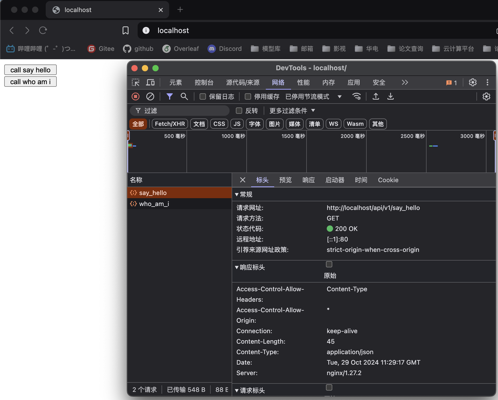
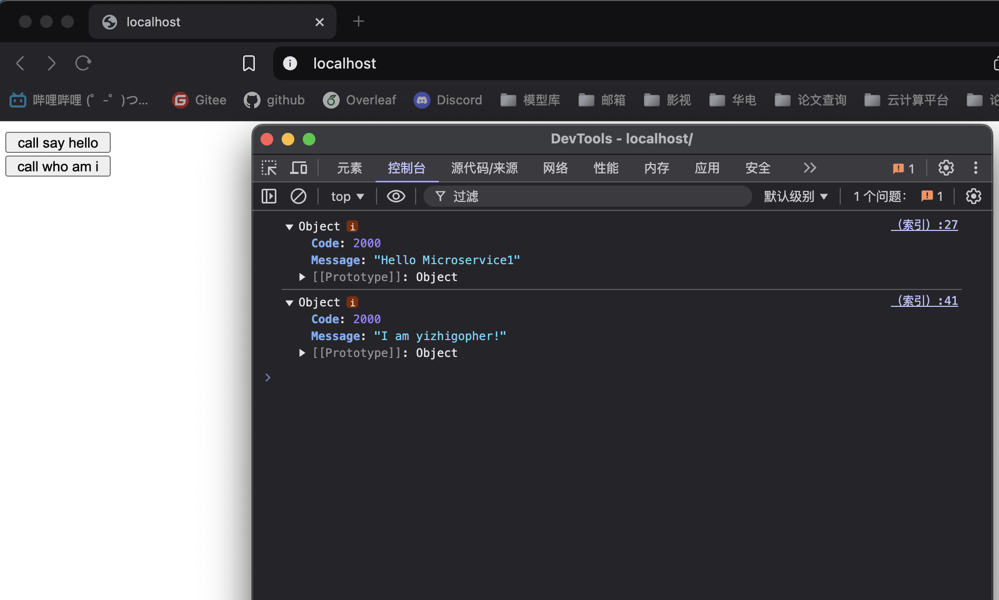

# 如何实现多个个容器之间的通讯


为了进行多个容器之间通讯的实验，首先我们需要创建两个服务，分别打包成不同的镜像，并通过docker-compose进行容器编排。本次实验的项目目录如下：
```
├── client
│   ├── dockerfile
│   ├── index.html
│   └── nginx.conf
├── docker-compose.yml
├── microservice1
│   ├── dockerfile
│   ├── main
│   └── main.go
└── microservice2
    ├── dockerfile
    ├── main
    └── main.go
```
# microservice后端服务定义
我们定义了两个后端服务，其代码如下：
```go
// microservice1/main.go
package main

import (
	"encoding/json"
	"net/http"
)

type Resp struct {
	Code    int
	Message string
}

func main() {
	http.HandleFunc("/say_hello", func(w http.ResponseWriter, r *http.Request) {
		w.Header().Set("Access-Control-Allow-Origin", "*")             //允许访问所有域
		w.Header().Add("Access-Control-Allow-Headers", "Content-Type") //header的类型
		w.Header().Set("content-type", "application/json")
		var data Resp
		if r.Method != "GET" {
			data = Resp{
				Code:    4000,
				Message: "Only Allow GET Method!",
			}
		} else {
			data = Resp{
				Code:    2000,
				Message: "Hello Microservice1",
			}
		}
		resp, _ := json.Marshal(data)
		w.Write(resp)
	})
	http.ListenAndServe(":8080", nil)
}
```
编译上述代码：
```shell
GOOS=linux GOARCH=amd64 go build main.go
```
另一个后端服务代码如下：
```go
// microservice2/main.go
package main

import (
	"encoding/json"
	"net/http"
)

func main() {
	http.HandleFunc("/who_am_i", func(w http.ResponseWriter, r *http.Request) {
		w.Header().Set("Access-Control-Allow-Origin", "*")             //允许访问所有域
		w.Header().Add("Access-Control-Allow-Headers", "Content-Type") //header的类型
		w.Header().Set("content-type", "application/json") 
		data := struct{
			Code int
			Message string
		}{
			Code: 2000,
			Message: "I am yizhigopher!",
		}
		resp, _ := json.Marshal(data)
		w.Write(resp)
	})
	http.ListenAndServe(":8080", nil)
}
```
使用上述命令编译代码。
并编写容器build脚本，每个后端服务的dockerfile一样：
```
FROM golang:1.23-alpine
WORKDIR /app
COPY ./main /app/microservice
EXPOSE 8080
ENTRYPOINT ["/app/microservice"]
```
# 前端界面定义
为了直观体现出不同容器之间通讯作用，我们编写了如下前端代码：
```html
<!-- client/index.html -->
<!DOCTYPE html>
<html lang="CH-ZN">

<head>
    <meta charset="UTF-8">
    <meta name="viewport" content="width=device-width, initial-scale=1.0">
    <meta http-equiv="X-UA-Compatible" content="ie=edge">
    
    <script src="https://code.jquery.com/jquery-3.7.1.min.js"></script>
</head>

<body>
    <button onclick="say_hello()" style="width:100px; height:20px">call say hello</button>
    <br/>
    <button onclick="whoami()" style="width:100px; height:20px">call who am i</button>
</body>

</html>
<script>
    function say_hello() {
        $.ajax({
            url: "http://localhost/api/v1/say_hello",
            type: "GET",
            dataType: "json",
            async: true,
            success: function(res) {
                console.log(res)
            },
            error: function(param) {
                console.log("fail, error=", param)
            }
        })
    }
    function whoami() {
        $.ajax({
            url: "http://localhost/api/v2/who_am_i",
            type: "GET",
            dataType: "json",
            async: true,
            success: function(res) {
                console.log(res)
            },
            error: function(param) {
                console.log("fail, error=", param)
            }
        })
    }
</script>
```
需要注意的是，其中每个接口请求的url为：**http://localhost/api/v1/say_hello**和**http://localhost/api/v2/who_am_i**。并编写nginx.conf配置代理：
```nginx
user  nginx;
worker_processes  auto;

error_log  /var/log/nginx/error.log warn;
pid        /var/run/nginx.pid;

events {
    worker_connections  1024;
}

http {
    include       /etc/nginx/mime.types;
    default_type  application/octet-stream;

    log_format  main  '$remote_addr - $remote_user [$time_local] "$request" '
                      '$status $body_bytes_sent "$http_referer" '
                      '"$http_user_agent" "$http_x_forwarded_for"';

    access_log  /var/log/nginx/access.log  main;

    sendfile        on;
    keepalive_timeout  65;

    # Server block for handling requests
    server {
        listen 80;
        server_name localhost;

        # 处理静态文件的请求（如果有）
        location / {
            root /fontend;
            index index.html;
        }

        location ^~/api/v1/ {
            proxy_pass http://router_one:8080/;
            proxy_set_header Host $host;
            proxy_set_header X-Real-IP $remote_addr;
            proxy_set_header X-Forwarded-For $proxy_add_x_forwarded_for;
        }

        location ^~/api/v2/ {
            proxy_pass http://router_two:8080/;
            proxy_set_header Host $host;
            proxy_set_header X-Real-IP $remote_addr;
            proxy_set_header X-Forwarded-For $proxy_add_x_forwarded_for;
        }
    }
}

```
我们注意到，代理的转发路径分别是**http://router_one:8080/**和**http://router_two:8080/**，其中不是IP地址，而是**容器名**。
# 容器编排以及通信测试
编写`docker-compose.yml`编排内容，配置如下：
```yml
version: '3'

services:
  font_end:
    image: fontend:v1
    build: ./client
    container_name: font_end
    ports:
      - 80:80
    volumes:
      - ./client/index.html:/fontend/index.html
      - ./client/nginx.conf:/etc/nginx/nginx.conf
    networks:
      - deploy

  microservice1: # 服务名，用于docker-compose中不同服务之间的通讯
    image: microservice1:v1 # 镜像名
    build: ./microservice1 # build镜像的地址
    container_name: router_one # 容器名，用于不同容器之间的通讯
    ports:
      - 8080:8080
    volumes:
      - ./microservice1/main:/app/microservice
    networks:
      - deploy

  microservice2:
    image: microservice2:v1
    build: ./microservice2
    container_name: router_two
    ports:
      - 8081:8080
    volumes:
      - ./microservice2/main:/app/microservice
    networks:
      - deploy
    
networks: # 设定网段
  deploy:  
    driver: bridge # 配置为桥接模式
```
运行`docker-compose up`，编排结果如下：

启动并访问`http://localhost`，结果如下：


观察上图，发现前后端对接成功，nginx成功向不同容器转发请求，实现了不同容器之间的通讯。
