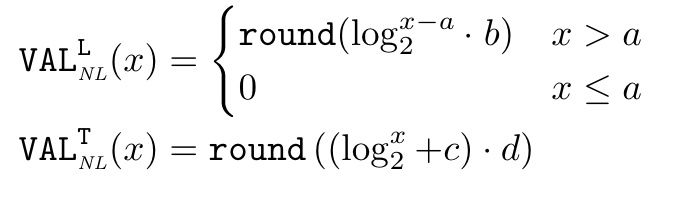
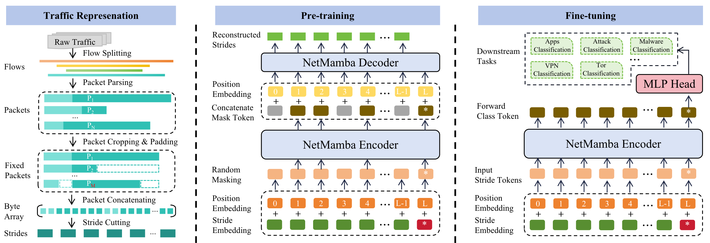

# 深度包检测技术

## 产生的背景
近年来，网络新业务层出不穷，有对等网络（Peer-to-Peer，简称 P2P）、VoIP、流媒体、Web TV、音视频聊天、互动在线游戏和虚拟现实等。这些新业务的普及为运营商吸纳了大量的客户资源，同时也对网络的底层流量模型和上层应用模式产生了很大的冲击，带来带宽管理、内容计费、信息安全、舆论管控等一系列新的问题。尤其是 P2P、VoIP、流媒体等业务。当前 P2P 业务的流量已占互联网数据流量的50%-70%，如果再加上流媒体等业务，新业务的数据流量是相当巨大的，这打破了以往“高带宽、低负载”的 IP 网络 QoS 提供模式，在很大程度上加重了网络拥塞，降低了网络性能，劣化了网络服务质量，妨碍了正常的网络业务的开展和关键应用的普及。同时，P2P 的广泛使用也给网络的信息安全监测管理带来了极大的挑战。

由于 P2P 流量的带宽吞噬特性，简单的网络升级扩容是无法满足运营商数据流量增长需要的，加上网络设备缺乏有效的技术监管手段，不能实现对 P2P/WEB TV 等新兴业务的感知和识别，导致网络运营商对网络的运行情况无法有效管理。

传统的网络运维管理，往往通过设备网管实现对网元级的管理，后来发展至网络级管理，可以对上层的简单应用进行管控，而这些应用级管控技术大多采用简单网络管理协议 SNMP 或者基于端口的流量识别进行进行分析和管理。

因此，如何深度感知互联网/移动互联网业务，提供应用级管控手段，构建“可运营、可管理”的网络，成为运营商关注的焦点。
## 什么是深度包检测技术
DPI 技术是一种基于应用层的流量检测和控制技术，称为“深度包检测”（Deep Packet Inspection）。所谓“深度”是和普通的报文分析层次相比较而言的，普通报文检测仅分析 IP 包的4层以下的内容，包括**源地址、目的地址、源端口、目的端口以及协议类型**。

而 DPI 除了对前面的层次分析外，还增加了应用层分析，识别各种应用及其内容。当 IP 数据包、TCP 或 UDP 数据流通过基于 DPI 技术的带宽管理系统时，该系统通过深入读取 **IP 包载荷的内容**来对 OSI 七层协议中的应用层信息进行重组，从而得到整个应用程序的内容。
然后按照系统定义的管理策略对流量进行整形操作。

总结：DPI 技术就是通过对应用流中的**数据报文内容**进行探测，从而确定数据报文的真正应用。

## 深度包检测技术应用：
### 将流量包数据转化为灰度图
#### iDetector: A Novel Real-Time Intrusion Detection Solution for IoT Networks[^1]
本文对采集到的流量数据，首先依据源地址和目标地址划分会话组，然后对每个会话组采用滑动窗口进行采样，并提出了一种名为NFT的特征处理方式，具体如下：

- 通过截断或加零构造**B**通道矩阵：由于采样会话中的数据包长度不一致，因此必须截断或零填充所有数据包的原始字节序列$\overline{V}^{*B}_n$以构造**B**通道向量$V^{*B}$。首先删除IP地址对字节，如果数据包的长度$p^{*}_n$大于$\lambda$，则丢弃第$\lambda$个字节之后的所有字节。如果长度小于$\lambda$，则在$\overline{V}^{*B}_n$的末尾执行加零。如果$p^{*}_n$的长度等于$\lambda$，则设$V^{*B}$等于$\overline{V}^{*B}_n$。最后将$\omega$**B**通道向量堆叠成形状为$(\omega, \lambda)$的特征矩阵。
- 构造**L**通道和**T**通道矩阵：数据包长度信息存储在每个数据包的报头中，可以通过解析提取。PCAP文件将每个数据包的捕获时间存储在元数据中，使得iDetector在离线工作时可以获得数据包的到达时间。当检测器在线工作时，我们记录数据包捕获时间戳，以获得数据包的到达间隔时间。由于数据包长度和到达间隔时间都是标量值，我们提出NFT算法将它们转换为向量，具体的转换方式如下：

#### NetMamba: Efficient Network Traffic Classification via Pre-training Unidirectional Mamba[^2]
对流量数据划分为不同的流，按它们的五元组属性分类：源IP、目的IP、源端口、目的端口和协议。然后为流中的每个数据包提取固定长度的首部和有效载荷字节段。为了在不因报文序列过长而影响模型效率的前提下收集更全面的流量信息，采用了ET-BERT和YaTC等先前研究中提出的方法，选择性地利用流中的特定报文。
1. 对于每个流，所有的数据包都经过几次顺序的操作来处理，以保留有价值的信息并消除不必要的干扰。同时考虑到包中包含的关键信息（例如，总长度字段）和有效载荷（上层协议的文本内容），因此也需对这部分数据信息进行分析处理。此外，为了减轻可识别信息带来的偏差，所有数据包都通过去除以太网标头进行匿名化。
2. 由于在同一流中包大小的变化，以及单个包中的报头长度（包括IP报头和任何上层报头）和负载长度的波动，经常会出现问题场景。例如，第一个长分组可能会占据整个有限的模型输入数组，或者过长的有效载荷可能会占据较短首部中的字节信息。因此，有必要对分组的长度进行标准化，即为所有分组分配统一的长度，并为分组首部和有效载荷分配固定的长度。具体来说，我们从单个流中选择前$M$个数据包，将首部长度设置为$N_h$字节，负载长度设置为$N_p$字节。任何超过此长度的数据包将被裁剪，而较短的数据包将被填充0以满足这些规格。

### 将流量包数据转化为文本
#### MERLOT: A Distilled LLM-based Mixture-of-Experts Framework for Scalable Encrypted Traffic Classification[^3]

[^1]: KONG X, ZHOU Y, XIAO Y, 等. iDetector: A Novel Real-Time Intrusion Detection Solution for IoT Networks[J/OL]. IEEE Internet of Things Journal, 2024: 1-1. DOI:10.1109/JIOT.2024.3416746.

[^2]: WANG T, XIE X, WANG W, 等. NetMamba: Efficient Network Traffic Classification via Pre-training Unidirectional Mamba[A/OL]. arXiv, 2024[2025-01-05]. http://arxiv.org/abs/2405.11449. DOI:10.48550/arXiv.2405.11449.

[^3]: CHEN Y, LI R, ZHAO Z, 等. MERLOT: A Distilled LLM-based Mixture-of-Experts Framework for Scalable Encrypted Traffic Classification[A/OL]. arXiv, 2024[2025-01-05]. http://arxiv.org/abs/2411.13004. DOI:10.48550/arXiv.2411.13004.

