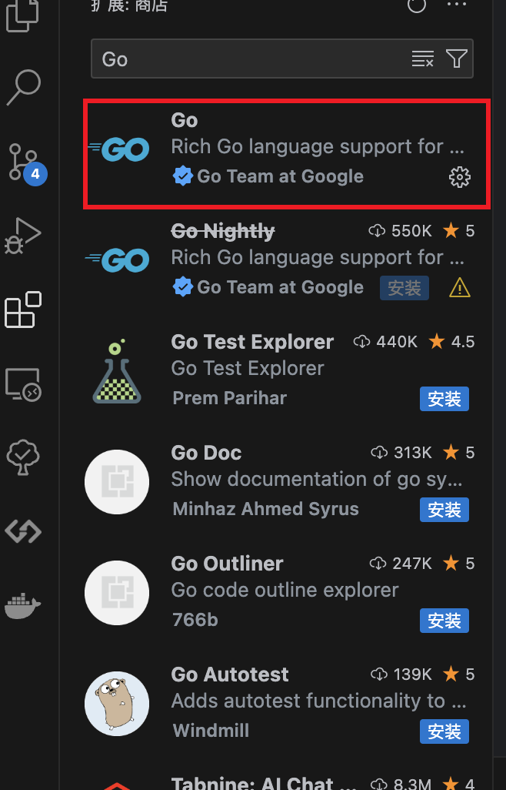
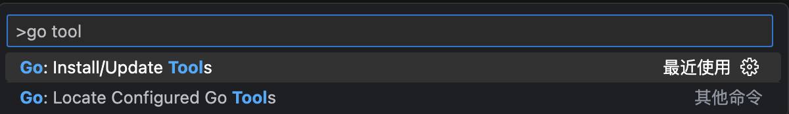
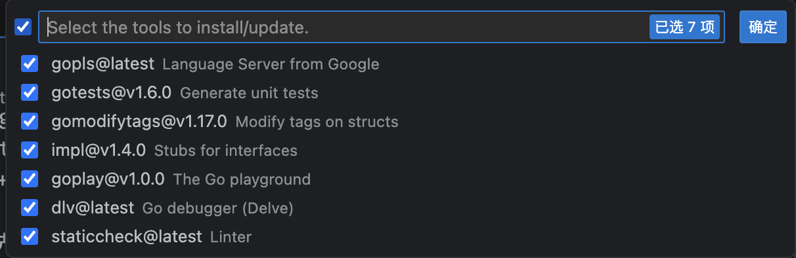

# vscode Go环境设置

首先你需要按照[这个教程](https://plutolove233.github.io/go-install)安装好Go环境。

之后在vscode插件商城中，搜寻`Go`，选择第一个进行安装。

安装好插件后，按下`Ctrl+Shift+P`快捷键，输入go tool，并安装所有工具。

观察在`${GOPATH}/bin`目录下是否存在这些工具的可执行文件。

重启vscode，即可。
